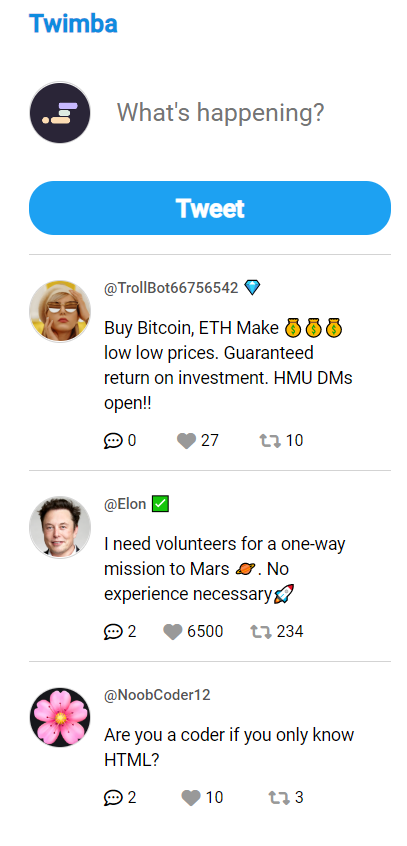

# Twimba-Twitter-Clone
## Table of contents

- [Overview](#overview)
  - [The challenge](#the-challenge)
  - [Screenshot](#screenshot)
- [My process](#my-process)
  - [What I learned](#What-I-learned)

## Overview

### The challenge

Twimba: Twitter Clone

### Screenshot

## My process

### What I learned

- textarea
- .forEach()
- data attributes
- conditionally render styles
- NOT operator (!)
- CDNs
  - add icons
  - generate UUIDs
